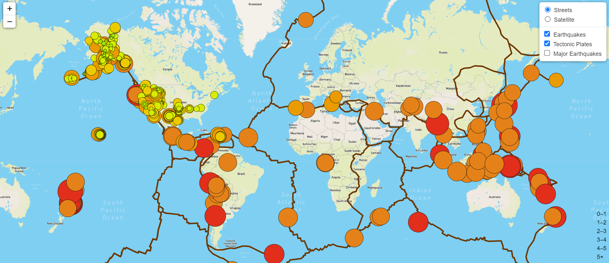
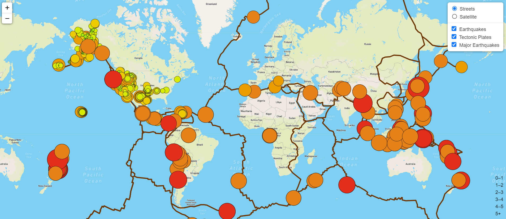
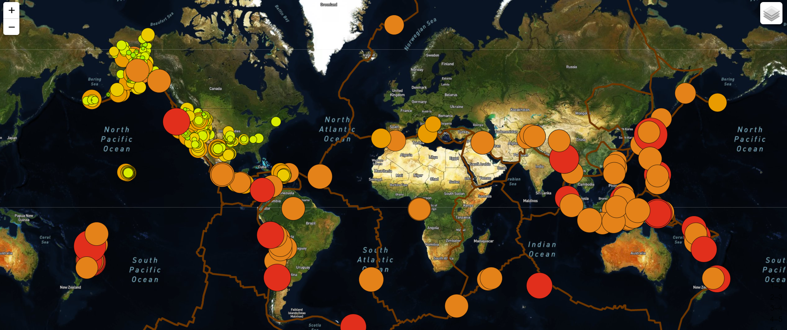

# Mapping_Earthquakes

## Project Overview
This project involves the use of HTML/CSS, JavaScript, Visual Studio. Earthquake GeoJSON data are collected from the USGS API, then interactive maps of earthquakes around the world are created and explored.

### This project consists of three technical analysis deliverables:
- Deliverable 1: Add Tectonic Plate Data
- Deliverable 2: Add Major Earthquake Data
- Deliverable 3: Add an Additional Map

## Resources
- Data Source:
- Software: HTML/CSS, JavaScript, Visual Studio

### Deliverable 1: Add Tectonic Plate Data

### Deliverable 2: Add Major Earthquake Data

### Deliverable 3: Add an Additional Map

